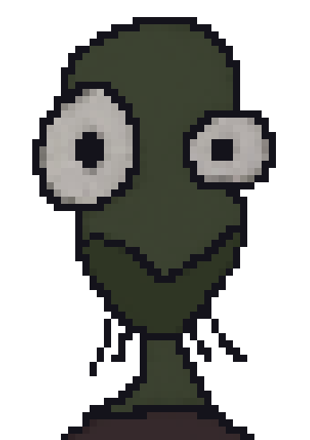
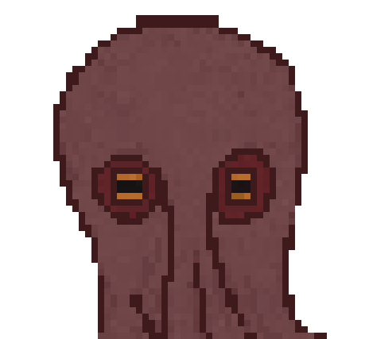

  
   
  

&nbsp;

NOTICE:  
There is an issue when adding multiple players & serving with tea  
please continue to use node/vscode live server until the tea bug is fixed.  
`node server.js`  
`vscode live server > index.html`

## Gettings Started
Install tea:  
`sh <(curl tea.xyz)`  

Note: If you do not wish to install tea you can replace `sh <(curl tea.xyz)` for every instance of `tea` below. If tea is already installed, it uses it, if not it *doesn’t* install tea, a temporary sandbox is created.   

Navigate to the game directory:  
`cd tea-game`

Install npm package dependencies:  
`tea -X npm install websocket pixi-text-input -webrtc-adapter`

Start signaling server:  
`tea scripts/server.js`

In another terminal start the game:  
`tea -X npx --yes browser-sync start --server`

Note: WSL2 users should execute the wsl.sh script from their wsl terminal before starting the signaling server. This shell script will automate changing the hostname in client.mjs to your wsl terminal ip address.  
