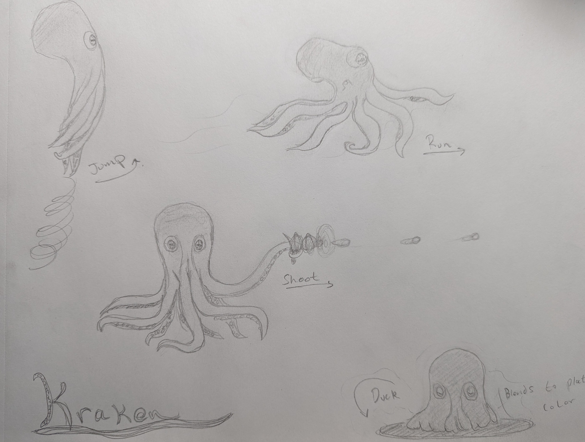

### first time setup
>execute startup shell script: ./play/startup.sh 
>OR 
>npm install websocket 
>npm install webrtc-adapter 
>cp node_modules/webrtc-adapter/out/adapter.js . 
>node server.js 

### start signaling server
>node server.js 

### start client
>use vscode live server on play/public/index.html

  

  

