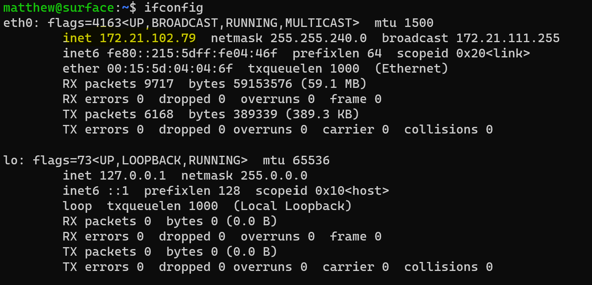
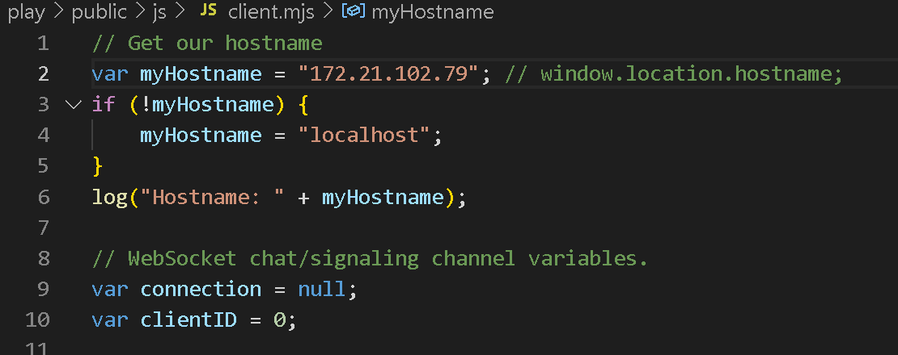

### First Time Setup
>execute startup shell script: ./play/startup.sh 
>OR 
>npm install websocket 
>npm install webrtc-adapter 
>cp node_modules/webrtc-adapter/out/adapter.js . 
>node server.js 

### To Run From WSL2
>execute wsl.sh script from wsl terminal before starting signaling server 
>wsl.sh will automate changing the hostname in client.mjs to your wsl terminal ip address 
 
 

### Start Signaling Server
>node server.js 

### Start Client
>use vscode live server on play/public/index.html

  
