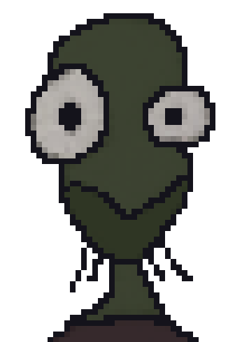
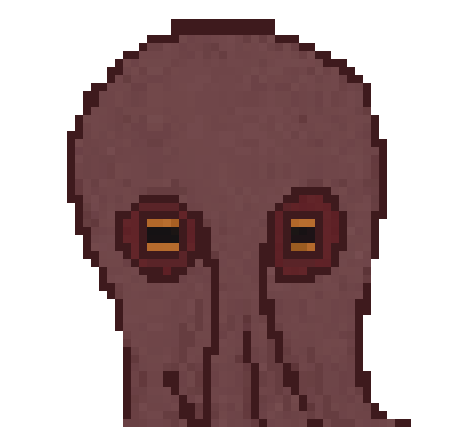

<p float="left">
  
   
  
</p>

# void - 2D Fighting Game

A browser-based 2-player fighting game inspired by Super Smash Bros, built with PixiJS and Matter.js.

## Features (v1.0)

- **Local 2-Player Duel**: Fight against a friend on the same device or network
- **Health & Damage System**: Smash Bros-style percentage damage with knockback
- **Multiple Characters**: Choose from Kraken, Glonky, Spaceman, or Void (each with unique stats)
- **Combat Mechanics**: Light attack (J), Heavy attack (K), Special attack (L)
- **Physics-Based Gameplay**: Realistic knockback and platform fighting
- **HUD Display**: Real-time health bars and damage percentage
- **Keyboard & Gamepad Support**: Full controller support for both players

## Controls

### Keyboard (Player 1)
- **Movement**: W (jump), A (left), D (right), S (duck)
- **Attacks**: J (light), K (heavy), L (special)

### Gamepad
- **Movement**: Left stick
- **Jump**: A button
- **Attacks**: X (light), Y (heavy), B (special)

## Getting Started

NOTICE: <br/>
There is an issue when adding multiple players & serving with tea <br/>
please continue to use node/vscode live server until the tea bug is fixed. <br/>
`node server.js` <br/>
`vscode live server > index.html`

### Quick Start (Recommended)

1. Navigate to the game directory:
```bash
cd game
```

2. Install dependencies:
```bash
npm install
```

3. Start the signaling server:
```bash
node server.js
```

4. In another terminal, start the game with a simple HTTP server:
```bash
npx http-server -p 8080
```

5. Open your browser to `http://localhost:8080`

### Alternative: Using Tea

Install tea: <br/>
`sh <(curl tea.xyz)` <br/>

Note: If you do not wish to install tea you can replace `sh <(curl tea.xyz)` for every instance of `tea` below. If tea is already installed, it uses it. If tea is not installed, then a temporary sandbox is created. <br/> 

Navigate to the game directory: <br/>
`cd game`

Install npm package dependencies: <br/>
`tea -X npm install`

Start signaling server: <br/>
`tea server.js`

In another terminal start the game: <br/>
`tea -X npx --yes browser-sync start --server`

Note: WSL2 users should execute the wsl.sh script from their wsl terminal before starting the signaling server. This shell script will automate changing the hostname in client.mjs to your wsl terminal ip address. <br/>

## How to Play

1. Start the game - it will bypass the login screen in development mode
2. Two players can join by opening multiple browser tabs/windows or connecting from different devices on the same network
3. Once both players are connected, "FIGHT!" will appear
4. Use your character's attacks to damage your opponent
5. The more damage a player takes, the further they get knocked back
6. Win by reducing your opponent's health to 0 or knocking them off the stage!

## Development Status

This is v1.0 - the first playable release focusing on core gameplay. Future updates will include:
- Character selection screen integration
- More animations and visual effects
- Sound effects and music
- Additional characters and stages
- Online multiplayer improvements
- Mobile support

## Tech Stack

- **Rendering**: PixiJS v7+
- **Physics**: Matter.js
- **Networking**: WebRTC (peer-to-peer) with WebSocket signaling
- **Input**: Keyboard & Gamepad API

## Known Issues

- Position sync between Pixi sprites and Matter bodies may have minor offsets
- Character animations limited (using placeholder "Shoot" animation for attacks)
- Limited to 2 players currently

## Contributing

Contributions welcome! This started as a passion project with friends. Feel free to open issues or submit PRs.

## License

MIT (or specify your license)
